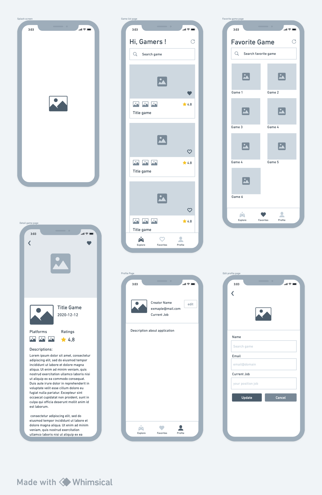

# game-info

Aplikasi GameInfo merupakan aplikasi catalog game yang di rancang khusus untuk keperluan submission akhir pada modul Belajar Fundamental Aplikasi IOS. Dalam membangun aplikasi ini terdapat beberapa halaman diantaranya adalah:

| No | Page Name                    | Fungsi                                                            |
| -- | -----------------------------| ------------------------------------------------------------------|
| 1  | Home                         | menampilkan catalog game                                          |
| 2  | Detail                       | menampilkan detail informasi dari catalog game yang di pilih      |
| 3  | Favorites                    | menampilkan list game yang sudah di wishlist ke favorite          |
| 4  | Profile                      | menjelaskan tentang aplikasi dan profile pembuat                  |
| 5  | Edit Profile                 | halaman untuk mengubah, mengupdate profile pengguna               |

berikut merupakan sketsa atau wireframe dari aplikasi PremierLeagueInfo:

###Project Architecture
This project utilizes Clean architecture pattern.

### Penjelasan Singkat
1. ketika user pertama kali masuk ke halaman utama atau home maka akan muncul loading terlebih dahulu yg mana proses ini membutuhkan waktu untuk mengambil data ke API https://rawg.io
2. apabila berhasil maka daftar game akan muncul di halaman home tersebut
3. jika user melakukan scroll ke bawah maka akan di temukan loading yg mana pada proses ini akan melakukan request ke api untuk menampilkan 10 list game berikutnya
4. user bisa melakukan pencarian dengan cara memasukan keywoards atau kata kunci di kolom pencarian
5. ketika user memilih salah satu game dari list maka akan di lanjutkan ke halaman detail game yang mana di halaman ini menampilkan deskripsi, gambar, rating, dan platforms yang support dari game tersebut
7. user dapat kembali ke halaman utama dengan menekan tombol navigasi back di pojok kanan atas
8. untuk menambahkan game favorite user dapat menekan icon heart di list maupun detail, jika sudah di tambahkan maka akan muncul di halaman list favorite pada tab favorite, dan icon heart akan berubah menjadi fill
9. user pun dapat menghapus game yg sudah di wishlist dengan cara meng klik icon heart baik di list maupun detail halaman game
10. pilih "icon person" atau tab "about" maka user dapat melihat deskripsi dan pembuat dari aplikasi Game Info ini
11. terdapat feature update profile yang mana akan merubah nama, email, dan juga current job dari pengguna dengan cara menekan tombol edit
