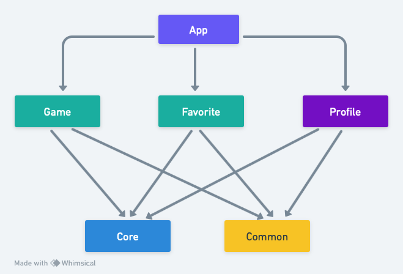
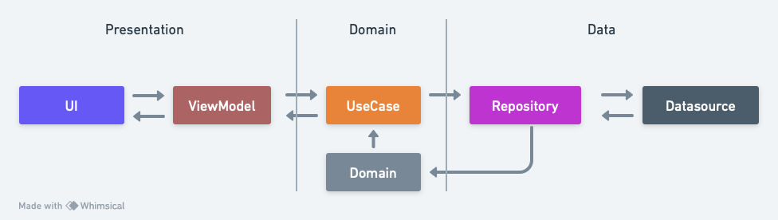

# game-info-advance

The GameInfoAdvance application is a game catalog application designed explicitly for submission purposes in the Become an iOS Developer Expert module. In building this application there are several pages including:

| No | Page Name                    | Fungsi                                                            |
| -- | -----------------------------| ------------------------------------------------------------------|
| 1  | Home                         | Display the game catalog                                          |
| 2  | Detail                       | Display detailed information from the selected game catalog       |
| 3  | Favorites                    | Display a list  of games that have been wishlisted to favourites  |
| 4  | Profile                      | Explain about the application and profile maker                   |
| 5  | Edit Profile                 | Page to change or update the user profile                         |

The following is a sketch or wireframe of the PremierLeagueInfo application:

### Project Architecture
This project has implemented modularization and uses the concept of the MVVM pattern with a Clean architecture approach.

### Description of feature
1. When the user first enters the main or home page, loading will appear first, which process takes time to retrieve data from the API https://rawg.io
2. If successful, a list of games will appear on the home page
3. If the user scrolls down, the infinity scroll feature will be found. This process will request the API to display the following ten game lists
4. Users can search by entering keywords or keywords in the search field
5. When the user selects a game from the list, it will proceed to the game detail page. This page displays a description, image, rating, and supported platforms of the game
7. The user can return to the main page by pressing the back navigation button in the upper right corner
8. The user can press the heart icon on the list or details to add a favorite game and show on the favorites list page on the favorites tab, and the heart icon will change to fill
9. Users can also delete games that are already on the wishlist by clicking the heart icon both on the list and on the game details page
10. Select the "icon person" or the "profile" tab so the user can see the description and creator of this Game Info application
11. There is a profile update feature that will change the user name, email, and current job by pressing the edit button
